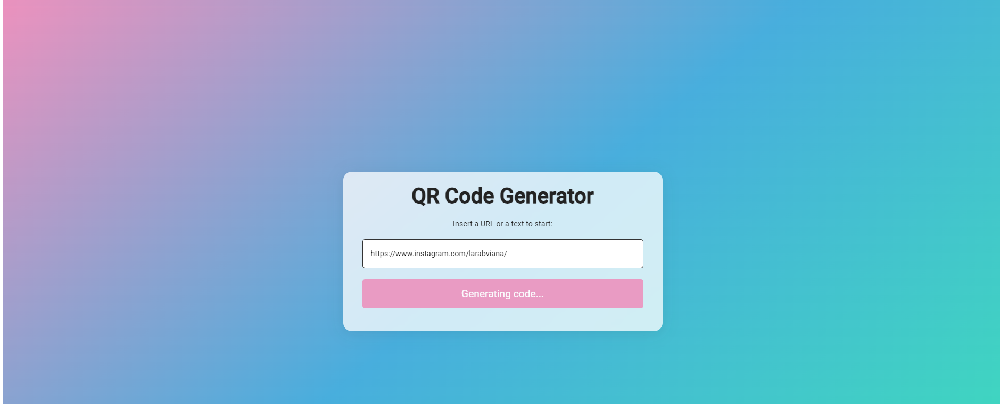
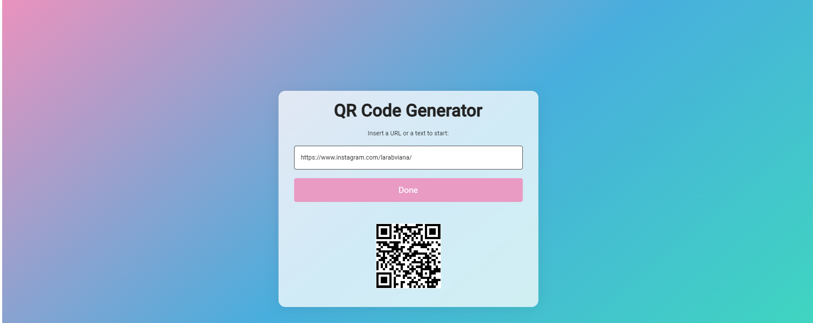

<h1 align="center"> Qr Code Generator</h1>

Turns everything into a QR Code.   

  <a href="#-tecnologias">Techs/Tecnologias</a>&nbsp;&nbsp;&nbsp;|&nbsp;&nbsp;&nbsp;
  <a href="#-projeto">Project/Projeto</a>&nbsp;&nbsp;&nbsp;|&nbsp;&nbsp;&nbsp;
  <a href="#-layout">Layout</a>&nbsp;&nbsp;&nbsp;|&nbsp;&nbsp;&nbsp;
  <a href="#memo-licença">License/Licença</a>

  

  

  

## 🚀 Techs / Tecnologias

Esse projeto foi desenvolvido com as seguintes tecnologias:

- HTML e CSS
- JavaScript
- Git e Github

## 💻 Project / Projeto

Um projeto de QR Code que transforma qualquer texto e ou site adicionado em um QR CODE via API.

A QR Code project that transforms any text or website added into a QR CODE via API.

## 🔖 Layout

Você pode visualizar o layout do projeto através do repositório. 

Feito com amor por Lara.